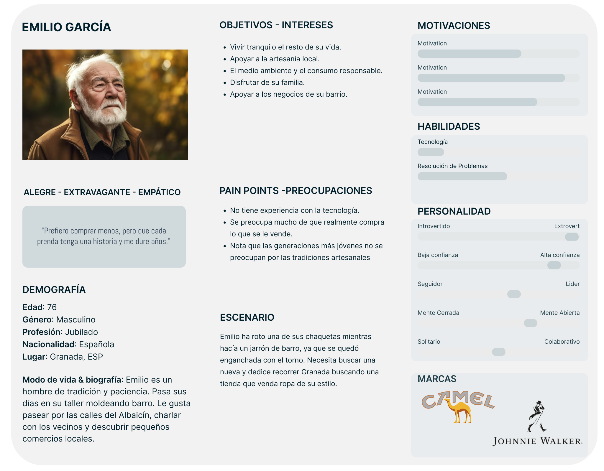
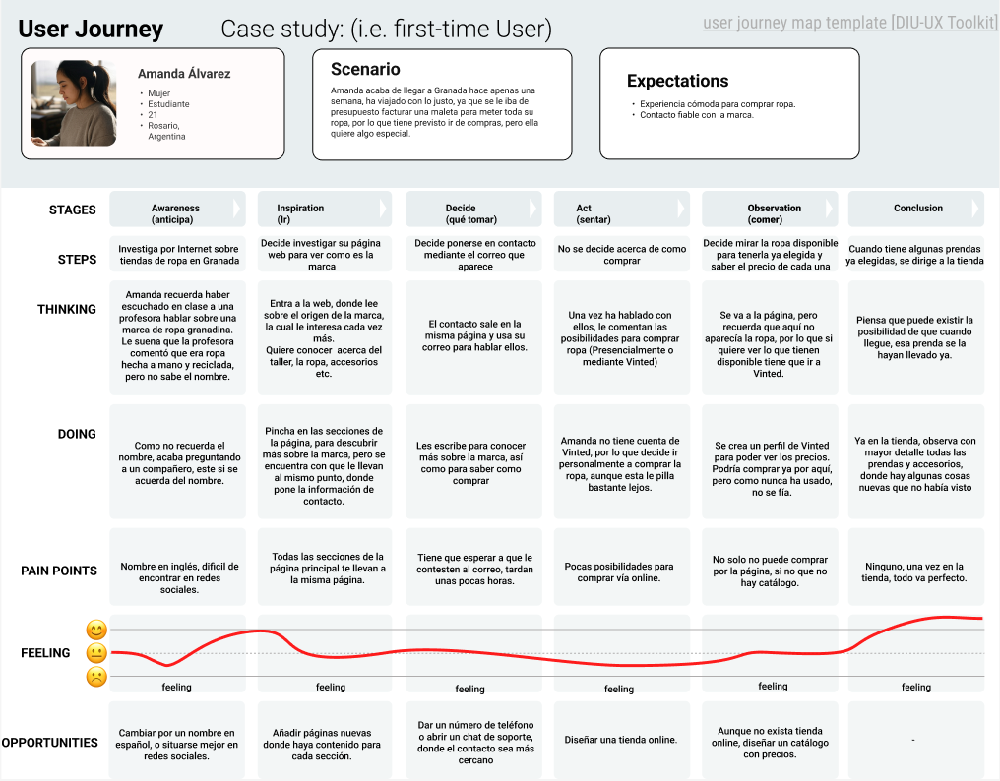
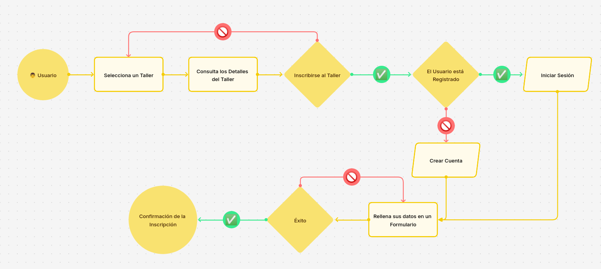
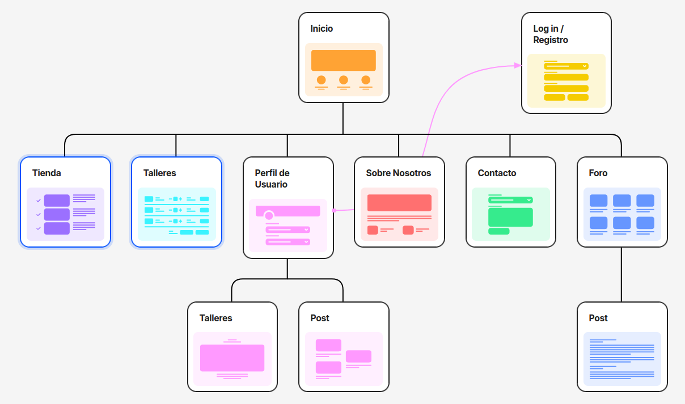

# DIU25
Prácticas Diseño Interfaces de Usuario (Tema: El ocio y comercio sostenible ) 

[Guiones de prácticas](GuionesPracticas/)

Grupo: DIU3_ExtremosYDuros.  Curso: 2024/25 

Actualizado: 25/03/2025

Proyecto: 

>>> Decida el nombre corto de su propuesta en la práctica 2 

Descripción: 

>>> Describa la idea de su producto en la práctica 2 

Logotipo: 

>>> Si diseña un logotipo para su producto en la práctica 3 pongalo aqui, a un tamaño adecuado. Si diseña un slogan añadalo aquí

Miembros:
 * :bust_in_silhouette:  Juan Pedro Moreno Ruiz  :octocat:  [https://github.com/Karylus](https://github.com/Karylus)
 * :bust_in_silhouette:  Salvador Molina Plaza   :octocat: [https://github.com/salvadormolinaa](https://github.com/salvadormolinaa)

----- 

# Proceso de Diseño 

 

## Paso 1. UX User & Desk Research & Analisis 

### 1.a User Reseach Plan
 
-----

El User Research se va a centrar en el contexto del Reciclaje y la Artenasía en Granada, teniendo como objetivo en este plan el de evaluar la experiencia de la compra y la navegación en la web de Re-Made in Granada, para detectar las posibles mejoras en accesibilidad y navegación del usuario en la web. Para identificar las distintas áreas de mejora, nos vamos a basar en la experiencia que tenemos usando otras páginas web de distintas tiendas de ropa mucho más grandes, aunque no sean artesanas, como pueden ser Zara, H&M o Springfield. 

Existen varios perfiles que hemos identificado como principales usuarios del sistema, aunque caben destacar dos. El primero de ellos es de una persona joven que está interesada por el medio ambiente y busca comprar ropa artesanal. El segundo es una persona mayor que valora la calidad y la exclusividad de las prendas, buscando ropa única y bien confeccionada, este perfil suele tener un poder adquisitivo medio-alto y prefiere invertir en piezas que duren en el tiempo en lugar de seguir las tendencias de la moda rápida.

Ambos perfiles nos ayudarán a evaluar distintos aspectos de la navegación y la experiencia de compra en la web de Re-Made in Granada, permitiéndonos detectar posibles barreras y oportunidades de mejora para hacer que el sitio sea más accesible y atractivo para todos los usuarios.

### 1.b Competitive Analysis
 
-----

Las aplicaciones que están asignadas a nuestro grupo, tratan sobre Reciclaje y artesanía: una web de ropa ecológica, otra web de cosas de barro y la tercera de ropa de segunda mano. En general todas las webs tienen bastantes fallos de diseño, pero nos hemos decidido por la de Casa Kuna porque a simple vista es la que más carencias tiene y mayores puntos de mejora.

### 1.c Personas
 
-----

Se han creado dos personas distintas. 

Amanda es una chica que acaba de llegar a Granada como estudiante de Erasmus, es argentina y estudia Bellas Artes. Le gusta conocer gente nueva, la música, leer y dibujar. Necesita comprar ropa nueva y quiere algo especial.

 

Emilio es una persona mayor del barrio del Albahicín en Granada, está jubilado desde hace 15 años. Dedica su tiempo libre a hacer alfarería y le encanta pasear por Granada buscando tiendas de ropa pequeñas y que considera especiales.

### 1.d User Journey Map
 
----

En cuanto al User Journey Map, se han creado dos hipotéticas situaciones que se ajustan lo máximo posible a una experiencia real de compra. En la primera situación, tenemos a Amanda, la cual no ha podido traerse toda su ropa de Argentina y recuerda que en clase una profesora habló sobre esta marca, pero no recuerda el nombre. 

En la segunda situación, Emilio ha roto una de sus chaquetas y necesita comprar una nueva, decide salir a pasear por Granada y se encuentra con la tienda de Re-Made donde ve una chaqueta que le gusta, pero está cerrada e intenta comprarla por internet.

### 1.e Usability Review
 
----

- Enlace al documento:   
- Valoración numérica obtenida: 59
- Comentario sobre la revisión:  La página, a nivel general, es pobre, tanto en diseño orientado al usuario, como en falta de acciones a realizar, falta de un catálogo, enlaces que llevan a páginas que no existen etc. Tiene alguna cosa aceptable, incluso buena, como la claridad en el menú, y la cabecera, que siempre está presente, pero en líneas generales, se pueden mejorar bastantes cosas.

 

## Paso 2. UX Design  

### 2.a Reframing / IDEACION: Feedback Capture Grid
 
----

  
Re Made es mucho más que una marca de ropa. Nuestro objetivo fundamental es la venta de ropa artesanal y con materiales reciclados, pero nuestra misión es algo mucho más grande. Queremos formar una comunidad de personas unidas entre sí, también queremos organizar talleres multitudinarios cada semana, así como crear una comunidad artística en la que tenga cabida todo tipo de persona. Los usuarios van a poder registrarse en la web, lo que les permitirá no solo comprar por la tienda, si no apuntarse a talleres, comunicarse mediante un foro con otros usuarios… Todos los talleres serán registrados y se podrán valorar, así como publicar fotos relacionadas con este. A los usuarios se les recomendarán talleres en función de los que ha participado anteriormente y sus valoraciones, de igual forma ocurre con la ropa, recomendando aquellas prendas y accesorios que creemos que pueden interesar a cada usuario.

### 2.b ScopeCanvas

----

### 2.b User Flow (task) analysis 
 
-----

En esta tabla se identifican las tareas y su relevancia para los usuarios. Distinguimos entre tres grupos de usuario:

- **Usuarios Registrados**: Usuario con una cuenta en la tienda. Puede comprar productos, inscribirse en talleres, participar en el foro e interactuar con otros usuarios.  
- **Usuarios No Registrados**: Usuario que visita la tienda y puede ver los productos, talleres y el foro, pero sin participar.  
- **Moderador**: Personal de la tienda que publica productos, administra talleres y supervisa la actividad en el foro.  

Tarea | Usuarios Registrados | Usuarios No Registrados | Moderador
|------------------------|---------------------|---------------------|------------|
Buscar productos/talleres | ALTA | ALTA | MEDIA |
Comprar productos | ALTA | NO PUEDE | NO PUEDE |
Inscribirse en talleres | ALTA | NO PUEDE | NO PUEDE |
Dejar reseñas en productos/talleres | MEDIA | NO PUEDE | MEDIA |
Publicar comentarios en talleres | MEDIA | NO PUEDE | MEDIA |
Eliminar comentarios propios | BAJA | NO PUEDE | MEDIA |
Registrarse | NO PUEDE | MEDIA | NO PUEDE |
Iniciar sesión | ALTA | NO PUEDE | ALTA |
Cerrar sesión | MEDIA | NO PUEDE | BAJA |
Gestionar pedidos | ALTA | NO PUEDE | ALTA |
Añadir productos a la tienda | NO PUEDE | NO PUEDE | ALTA |
Gestionar talleres | NO PUEDE | NO PUEDE | ALTA |
Ver publicaciones | ALTA | ALTA | ALTA |
Crear publicaciones | ALTA | NO PUEDE | MEDIA |
Comentar publicaciones | MEDIA | NO PUEDE | MEDIA |
Eliminar propias publicaciones | BAJA | NO PUEDE | MEDIA |
Moderar contenido | NO PUEDE | NO PUEDE | ALTA |

Con respecto a los distintos User Flow que se pueden llevar a cabo en nuestra tienda, vamos a mostrar los 3 que consideramos mas importantes; registrarse en la web, publicar un post en el foro y apuntarse a un taller. Con estos tres user flows pensamos que se abarca el totalidad de las acciones que un usuario podría llevar a cabo en nuestra web.

### 2.c IA: Sitemap + Labelling 
 
----

Término | Significado     
| ------------- | -------
Inicio | Página principal de la plataforma  
Log in / Registro | Acceder o registrarse en la plataforma  
Tienda | Sección para comprar productos  
Producto | Página de un producto específico  
Talleres | Sección de inscripción a talleres  
Mis Talleres | Talleres en los que está inscrito el usuario  
Perfil de Usuario | Información y configuración del usuario  
Mis Post | Publicaciones del usuario en el foro  
Sobre Nosotros | Información sobre Casa Kuna  
Contacto | Formulario para contactar con Casa Kuna  
Foro | Espacio de discusión entre usuarios  
Post | Página de un tema específico en el foro  

### 2.d Wireframes
 
-----

>>> Plantear el diseño del layout para Web/movil (organización y simulación). Describa la herramienta usada 

 

## Paso 3. Mi UX-Case Study (diseño)

>>> Cualquier título puede ser adaptado. Recuerda borrar estos comentarios del template en tu documento

### 3.a Moodboard

-----

>>> Diseño visual con una guía de estilos visual (moodboard) 
>>> Incluir Logotipo. Todos los recursos estarán subidos a la carpeta P3/
>>> Explique aqui la/s herramienta/s utilizada/s y el por qué de la resolución empleada. Reflexione ¿Se puede usar esta imagen como cabecera de Instagram, por ejemplo, o se necesitan otras?

### 3.b Landing Page
 
----

>>> Plantear el Landing Page del producto. Aplica estilos definidos en el moodboard

### 3.c Guidelines
 
----

>>> Estudio de Guidelines y explicación de los Patrones IU a usar 
>>> Es decir, tras documentarse, muestre las deciones tomadas sobre Patrones IU a usar para la fase siguiente de prototipado. 

### 3.d Mockup
 
----

>>> Consiste en tener un Layout en acción. Un Mockup es un prototipo HTML que permite simular tareas con estilo de IU seleccionado. Muy útil para compartir con stakeholders

### 3.e ¿My UX-Case Study?
 
-----

>>> Publicar my Case Study en Github... Es el momento de dejar este documento para que sea evaluado y calificado como parte de la práctica
>>> Documente bien la cabecera y asegurese que ha resumido los pasos realizados para el diseño de su producto

 

## Paso 4. Pruebas de Evaluación 

### 4.a Reclutamiento de usuarios 

-----

>>> Breve descripción del caso asignado (llamado Caso-B) con enlace al repositorio Github
>>> Tabla y asignación de personas ficticias (o reales) a las pruebas. Exprese las ideas de posibles situaciones conflictivas de esa persona en las propuestas evaluadas. Mínimo 4 usuarios: asigne 2 al Caso A y 2 al caso B.

| Usuarios | Sexo/Edad     | Ocupación   |  Exp.TIC    | Personalidad | Plataforma | Caso
| ------------- | -------- | ----------- | ----------- | -----------  | ---------- | ----
| User1's name  | H / 18   | Estudiante  | Media       | Introvertido | Web.       | A 
| User2's name  | H / 18   | Estudiante  | Media       | Timido       | Web        | A 
| User3's name  | M / 35   | Abogado     | Baja        | Emocional    | móvil      | B 
| User4's name  | H / 18   | Estudiante  | Media       | Racional     | Web        | B 

### 4.b Diseño de las pruebas 
 
-----

>>> Planifique qué pruebas se van a desarrollar. ¿En qué consisten? ¿Se hará uso del checklist de la P1?

### 4.c Cuestionario SUS
 
----

>>> Como uno de los test para la prueba A/B testing, usaremos el **Cuestionario SUS** que permite valorar la satisfacción de cada usuario con el diseño utilizado (casos A o B). Para calcular la valoración numérica y la etiqueta linguistica resultante usamos la [hoja de cálculo](https://github.com/mgea/DIU19/blob/master/Cuestionario%20SUS%20DIU.xlsx). Previamente conozca en qué consiste la escala SUS y cómo se interpretan sus resultados
http://usabilitygeek.com/how-to-use-the-system-usability-scale-sus-to-evaluate-the-usability-of-your-website/)
Para más información, consultar aquí sobre la [metodología SUS](https://cui.unige.ch/isi/icle-wiki/_media/ipm:test-suschapt.pdf)
>>> Adjuntar en la carpeta P4/ el excel resultante y describa aquí la valoración personal de los resultados 

### 4.d A/B Testing
 
-----

>>> Los resultados de un A/B testing con 3 pruebas y 2 casos o alternativas daría como resultado una tabla de 3 filas y 2 columnas, además de un resultado agregado global. Especifique con claridad el resultado: qué caso es más usable, A o B?

### 4.e Aplicación del método Eye Tracking 

----

>>> Indica cómo se diseña el experimento y se reclutan los usuarios. Explica la herramienta / uso de gazerecorder.com u otra similar. Aplíquese únicamente al caso B.

  
>>> Cambiar esta img por una de vuestro experimento. El recurso deberá estar subido a la carpeta P4/  

>>> gazerecorder en versión de pruebas puede estar limitada a 3 usuarios para generar mapa de calor (crédito > 0 para que funcione) 

### 4.f Usability Report de B
 
-----

>>> Añadir report de usabilidad para práctica B (la de los compañeros) aportando resultados y valoración de cada debilidad de usabilidad. 
>>> Enlazar aqui con el archivo subido a P4/ que indica qué equipo evalua a qué otro equipo.

>>> Complementad el Case Study en su Paso 4 con una Valoración personal del equipo sobre esta tarea

 

## Paso 5. Exportación y Documentación 

### 5.a Exportación a HTML/React
 
----

>>> Breve descripción de esta tarea. Las evidencias de este paso quedan subidas a P5/

### 5.b Documentación con Storybook

----

>>> Breve descripción de esta tarea. Las evidencias de este paso quedan subidas a P5/

 

## Conclusiones finales & Valoración de las prácticas

>>> Opinión FINAL del proceso de desarrollo de diseño siguiendo metodología UX y valoración (positiva /negativa) de los resultados obtenidos. ¿Qué se puede mejorar? Recuerda que este tipo de texto se debe eliminar del template que se os proporciona 

